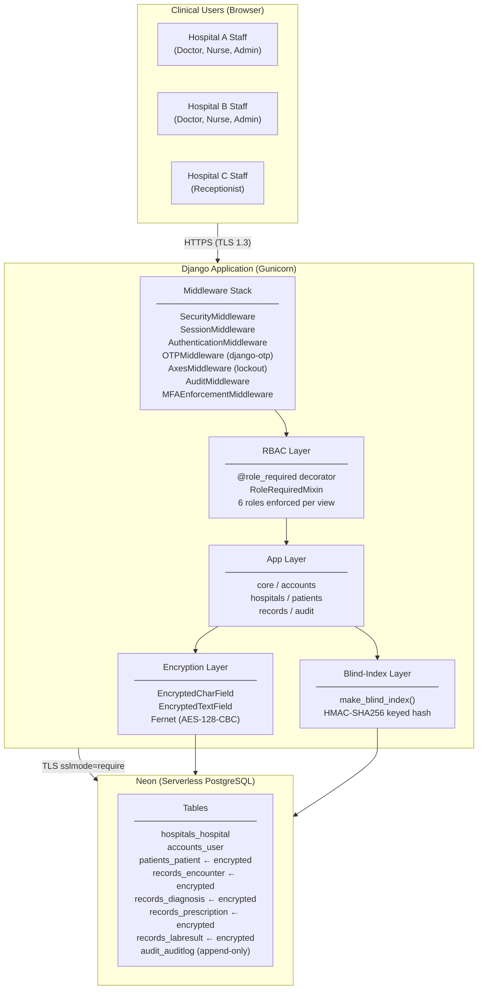
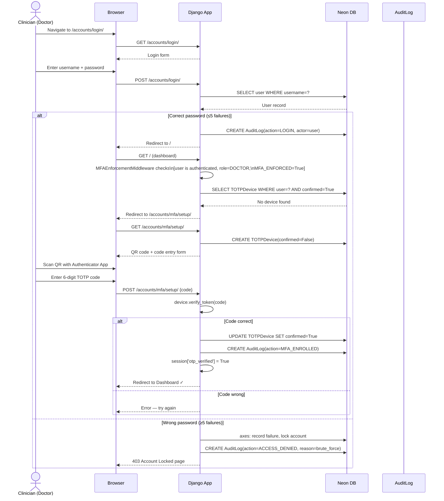
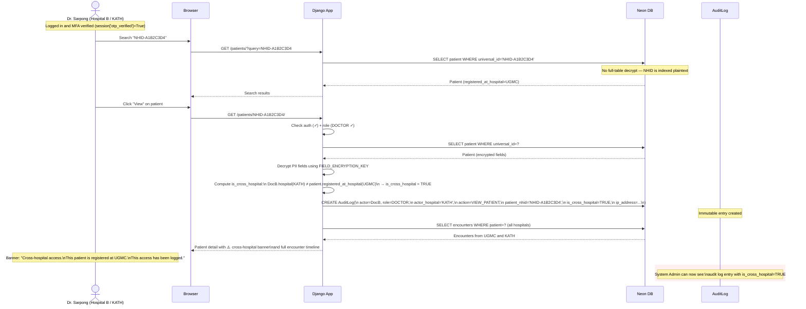
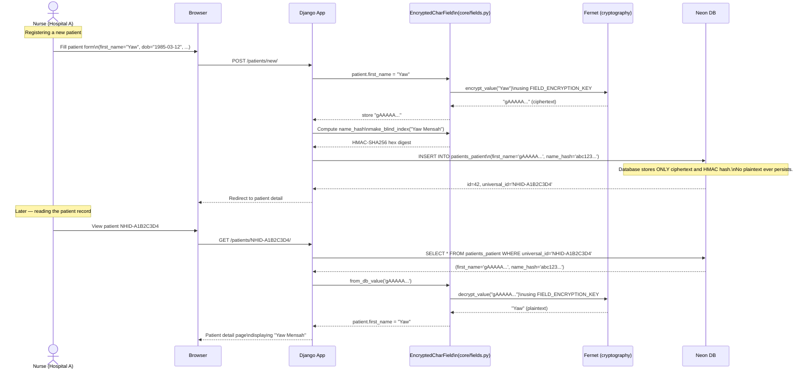
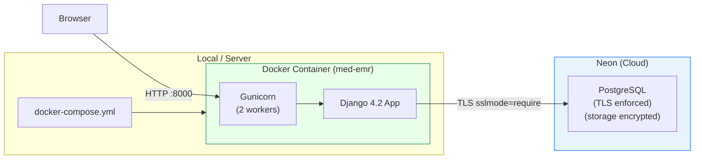
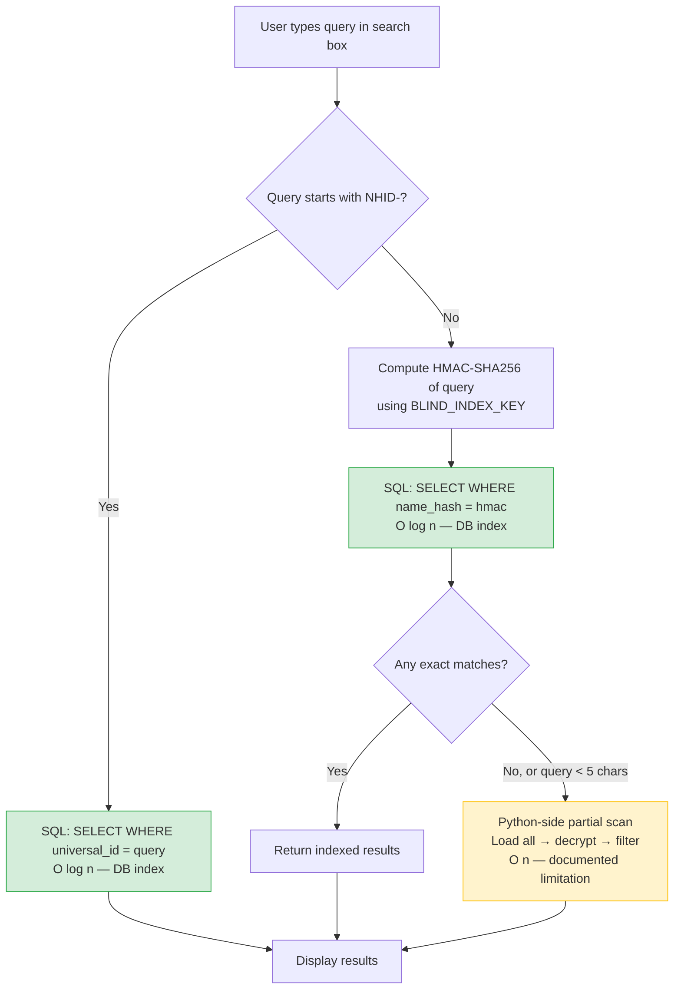

# Architecture & Sequence Diagrams — mEd Secure Centralised EMR System

## 1. Component Diagram

---

## 2. Sequence Diagram: Login + MFA Verification

This shows the full login flow when `MFA_ENFORCED=True` for a clinical user.

---

## 3. Sequence Diagram: Cross-Hospital Patient Access with Audit Flag

This is the core inter-hospital access scenario. A Doctor at Hospital B accesses
a patient whose records were created at Hospital A.

---

## 4. Sequence Diagram: Encrypted Write / Read Path

This shows how PII flows through the encryption layer when creating and
subsequently reading a patient record.

---

## 5. Deployment Architecture (Docker + Neon)

---

## 6. Data Flow: Search with Blind Index

