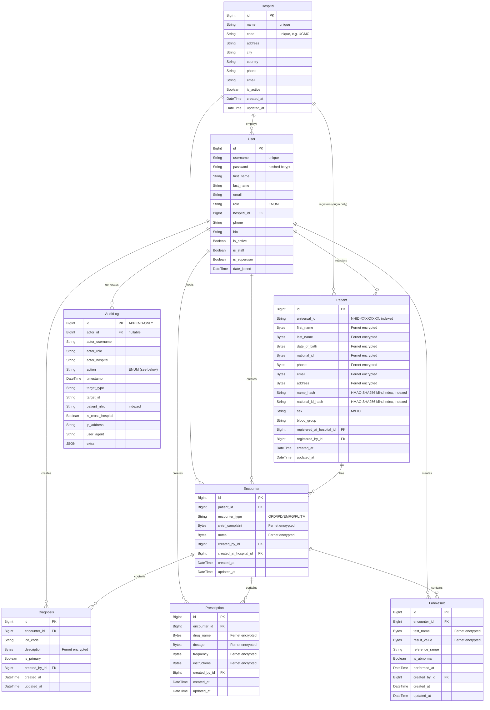

# Data Model — mEd Secure Centralised EMR System

## Entity-Relationship Diagram

---

## Data Dictionary

### Hospital

| Field | Type | Encrypted | Description |
|-------|------|-----------|-------------|
| `id` | BigInt PK | No | Auto primary key |
| `name` | VARCHAR(200) unique | No | Full hospital name |
| `code` | VARCHAR(10) unique | No | Short facility code (e.g. UGMC) |
| `address` | TEXT | No | Postal address |
| `city` | VARCHAR(100) | No | City |
| `country` | VARCHAR(100) | No | Country (default Ghana) |
| `phone` | VARCHAR(30) | No | Contact phone |
| `email` | VARCHAR(254) | No | Contact email |
| `is_active` | Boolean | No | Whether hospital is participating |
| `created_at` / `updated_at` | DateTime | No | Audit timestamps |

---

### User (Staff)

| Field | Type | Encrypted | Description |
|-------|------|-----------|-------------|
| `id` | BigInt PK | No | Auto primary key |
| `username` | VARCHAR(150) unique | No | Login username |
| `password` | VARCHAR(128) | No | Argon2/bcrypt hash (never plaintext) |
| `role` | VARCHAR(20) | No | `SYSTEM_ADMIN`, `HOSPITAL_ADMIN`, `DOCTOR`, `NURSE`, `LAB_TECH`, `RECEPTIONIST` |
| `hospital` | FK → Hospital | No | Home hospital (NULL for SYSTEM_ADMIN) |
| `first_name` / `last_name` | VARCHAR | No | Display name |
| `email` | VARCHAR(254) | No | Staff email |
| `phone` | VARCHAR(20) | No | Contact phone |
| `is_staff` / `is_superuser` | Boolean | No | Django admin flags |

---

### Patient

| Field | Type | Encrypted | Description |
|-------|------|-----------|-------------|
| `id` | BigInt PK | No | Auto primary key |
| `universal_id` | VARCHAR(20) unique, indexed | No | `NHID-XXXXXXXX` — global patient identifier |
| `first_name` | TEXT (ciphertext) | **YES** (Fernet) | Given name |
| `last_name` | TEXT (ciphertext) | **YES** (Fernet) | Family name |
| `date_of_birth` | TEXT (ciphertext) | **YES** (Fernet) | DOB in YYYY-MM-DD format |
| `national_id` | TEXT (ciphertext) | **YES** (Fernet) | National ID or passport number |
| `phone` | TEXT (ciphertext) | **YES** (Fernet) | Contact phone number |
| `email` | TEXT (ciphertext) | **YES** (Fernet) | Email address |
| `address` | TEXT (ciphertext) | **YES** (Fernet) | Postal address |
| `name_hash` | CHAR(64), indexed | No | HMAC-SHA256 of `first_name last_name` (lowercase) — blind index for exact name search without decryption |
| `national_id_hash` | CHAR(64), indexed | No | HMAC-SHA256 of `national_id` — blind index for exact ID lookup |
| `sex` | CHAR(1) | No | `M` / `F` / `O` |
| `blood_group` | VARCHAR(3) | No | ABO/Rh (not sensitive individually) |
| `registered_at_hospital` | FK → Hospital | No | Origin facility (informational only, not an access gate) |
| `registered_by` | FK → User | No | Registering staff member |

---

### Encounter

| Field | Type | Encrypted | Description |
|-------|------|-----------|-------------|
| `id` | BigInt PK | No | Auto primary key |
| `patient` | FK → Patient | No | The patient this visit belongs to |
| `encounter_type` | VARCHAR(4) | No | `OPD`, `IPD`, `EMRG`, `FU`, `TM` |
| `chief_complaint` | TEXT (ciphertext) | **YES** (Fernet) | Presenting problem |
| `notes` | TEXT (ciphertext) | **YES** (Fernet) | Clinical notes |
| `created_by` | FK → User | No | Clinician who opened the encounter |
| `created_at_hospital` | FK → Hospital | No | Facility where the encounter occurred |

---

### Diagnosis

| Field | Type | Encrypted | Description |
|-------|------|-----------|-------------|
| `encounter` | FK → Encounter | No | Parent encounter |
| `icd_code` | VARCHAR(20) | No | ICD-10 code (non-sensitive code) |
| `description` | TEXT (ciphertext) | **YES** (Fernet) | Clinical diagnosis text |
| `is_primary` | Boolean | No | Whether this is the primary diagnosis |
| `created_by` | FK → User | No | Clinician who recorded it |

---

### Prescription

| Field | Type | Encrypted | Description |
|-------|------|-----------|-------------|
| `encounter` | FK → Encounter | No | Parent encounter |
| `drug_name` | TEXT (ciphertext) | **YES** (Fernet) | Medication name |
| `dosage` | TEXT (ciphertext) | **YES** (Fernet) | Dose and route |
| `frequency` | TEXT (ciphertext) | **YES** (Fernet) | Timing and duration |
| `instructions` | TEXT (ciphertext) | **YES** (Fernet) | Additional instructions |
| `created_by` | FK → User | No | Prescribing doctor |

---

### LabResult

| Field | Type | Encrypted | Description |
|-------|------|-----------|-------------|
| `encounter` | FK → Encounter | No | Parent encounter |
| `test_name` | TEXT (ciphertext) | **YES** (Fernet) | Name of the test |
| `result_value` | TEXT (ciphertext) | **YES** (Fernet) | Result value and units |
| `reference_range` | VARCHAR(100) | No | Normal range (not itself sensitive) |
| `is_abnormal` | Boolean | No | Flag if result is outside reference range |
| `performed_at` | DateTime | No | When the test was performed |

---

### AuditLog (Append-Only)

| Field | Type | Description |
|-------|------|-------------|
| `id` | BigInt PK | Auto primary key — CANNOT be updated or deleted |
| `actor` | FK → User (nullable) | User who performed the action |
| `actor_username` | VARCHAR(150) | Denormalised username at time of action |
| `actor_role` | VARCHAR(20) | Denormalised role at time of action |
| `actor_hospital` | VARCHAR(200) | Denormalised hospital at time of action |
| `action` | VARCHAR(30) | See Action Enum below |
| `timestamp` | DateTime | When the action occurred |
| `target_type` | VARCHAR(50) | Model class name of the accessed object |
| `target_id` | VARCHAR(50) | PK of the accessed object |
| `patient_nhid` | VARCHAR(20), indexed | Patient NHID (for audit filtering by patient) |
| `is_cross_hospital` | Boolean | **True when actor's hospital ≠ the record's origin hospital** |
| `ip_address` | GenericIPAddress | Client IP address |
| `user_agent` | TEXT | Browser user-agent |
| `extra` | JSON | Additional context (reason, path, etc.) |

#### AuditLog Action Enum

| Action | Trigger |
|--------|---------|
| `LOGIN` | Successful login |
| `LOGOUT` | User logs out |
| `VIEW_PATIENT` | Patient detail page accessed |
| `CREATE_PATIENT` | New patient registered |
| `UPDATE_PATIENT` | Patient demographics edited |
| `VIEW_ENCOUNTER` | Encounter detail page accessed |
| `CREATE_ENCOUNTER` | New encounter opened |
| `CREATE_DIAGNOSIS` | Diagnosis recorded |
| `CREATE_PRESCRIPTION` | Prescription written |
| `CREATE_LAB_RESULT` | Lab result recorded |
| `ACCESS_DENIED` | 403 Forbidden (RBAC violation) or brute-force lockout |
| `PASSWORD_CHANGE` | User changes own password |
| `MFA_ENROLLED` | User completes TOTP enrolment |
| `MFA_VERIFIED` | User passes TOTP check this session |
| `MFA_REMOVED` | User removes TOTP device |

---

## Encryption Coverage Summary

| Table | Fields Encrypted | Fields Plaintext |
|-------|-----------------|------------------|
| `hospitals_hospital` | None | All (non-PHI) |
| `accounts_user` | None (password is hashed, not encrypted) | All |
| `patients_patient` | `first_name`, `last_name`, `date_of_birth`, `national_id`, `phone`, `email`, `address` | `universal_id`, sex, blood_group, hospital FKs, blind indexes |
| `records_encounter` | `chief_complaint`, `notes` | type, FKs, timestamps |
| `records_diagnosis` | `description` | icd_code, is_primary, FKs |
| `records_prescription` | `drug_name`, `dosage`, `frequency`, `instructions` | FKs, timestamps |
| `records_labresult` | `test_name`, `result_value` | reference_range, is_abnormal, FKs |
| `audit_auditlog` | None (audit metadata is intentionally plaintext) | All |
| `patients_patientalert` | `label` (substance), `reaction` | kind, severity, is_active, hospital FKs |

---

## Encryption–Queryability Trade-off

Field-level Fernet encryption provides strong at-rest confidentiality for PII/PHI, but it comes with a fundamental constraint: **encrypted columns cannot be sorted, range-queried, or aggregated at the database layer.**

### Specific consequences

| Operation | Encrypted field | Workaround |
|---|---|---|
| Exact name lookup | `first_name + last_name` | **Blind index** (`name_hash` — HMAC-SHA256 of normalised name) stored as a plain indexed column. Allows O(log n) exact-match queries. |
| Exact national-ID lookup | `national_id` | **Blind index** (`national_id_hash`) — same technique. |
| Partial name search | `first_name + last_name` | **Python-side decrypt scan** — every Patient row is fetched and decrypted in memory, then substring-matched. O(n) and slow at scale. See note below. |
| Sort patients by name | `first_name` | Not directly possible. Workaround: decrypt all, sort in Python (impractical at scale). |
| Age range query | `date_of_birth` | Not possible at DB layer. Age computation done in Python per-patient (`patients/banner.py:_compute_age`). |
| DOB statistics (e.g. patients > 65) | `date_of_birth` | Would require Python-side scan over all patients. Not currently implemented. |

### Why this is the right trade-off

The alternatives — storing names/DOBs in plaintext, or using a trusted database extension like pgcrypto — either expose PII in the database or shift key management to the DB layer (where it may be less auditable). For a prototype inter-hospital system where the DB may be hosted by a third party (Neon serverless), application-layer encryption with a separate key is the cleaner model.

The practical limitation is the **partial-name scan** (O(n) decrypt). This is documented as a known scaling limitation. Production replacement paths include: a dedicated encrypted-search index (e.g. deterministic encryption with a separate key for searchable fields), or an external search service that stores only the blind index.

### Blind-index security note

A blind index (HMAC of the normalised plaintext) reveals whether two patients share the same name, which is a form of information leakage. The `BLIND_INDEX_KEY` is a separate key from `FIELD_ENCRYPTION_KEY`, stored separately, so compromise of one does not compromise the other. HMAC-SHA256 with a 256-bit key is pre-image resistant — an attacker who only sees the `name_hash` column cannot recover the plaintext without also breaking the HMAC or compromising the key.
