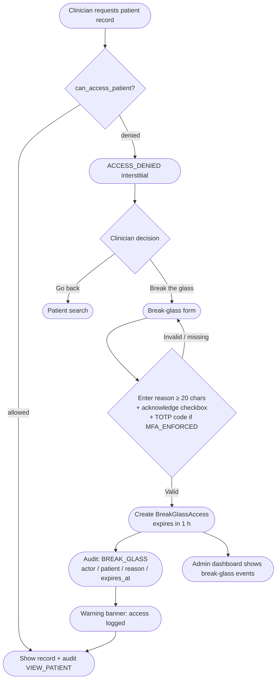

# Business Process Models

Mermaid swimlane diagrams for the two defining clinical workflows.

## 1. Admission → Encounter → Orders → Results → Discharge

```mermaid
sequenceDiagram
    participant R as Receptionist
    participant D as Doctor / Nurse
    participant L as Lab Technician
    participant S as EMR System

    R->>S: Search patient by NHID / name / national ID
    S-->>R: Patient found (or EMPI duplicate warning)
    R->>S: Register patient (if new)
    S-->>R: NHID assigned; TreatmentRelationship auto-checked

    D->>S: Open encounter (OPD / IPD / Emergency)
    S->>S: can_access_patient() → same_hospital OK
    S->>S: Auto-create TreatmentRelationship
    S-->>D: Encounter created; audit: CREATE_ENCOUNTER

    D->>S: Add diagnosis (ICD-10 + SNOMED optional)
    S-->>D: Diagnosis saved; audit: CREATE_DIAGNOSIS

    D->>S: Add prescription (RxNorm optional)
    S-->>D: Prescription saved; audit: CREATE_PRESCRIPTION

    D->>S: Request lab test (order logged as Encounter note)
    L->>S: Record lab result (LOINC code)
    S-->>L: Lab result saved; audit: CREATE_LAB_RESULT

    D->>S: View complete record & review encounter
    S-->>D: Patient + all Encounters decrypted; audit: VIEW_PATIENT
    Note over D,S: Encounter persisted chronologically (Status: OPEN)<br/>Administrative discharge is scoped for Phase 2
```

> **Architectural Scope Boundary — Encounter Lifecycle vs. Immutability:**
> In the current system, clinical encounters persist as immutable, append-only chronological consultation records created with default status `OPEN`. The prototype focuses on immutable chronological encounter creation; administrative discharge and status transitions (`COMPLETED`, `SIGNED_OFF`) represent a planned Phase 2 administrative lifecycle extension. This design prevents retrospective chart alteration and guarantees complete chronological auditability.

---

## 2. Inter-Hospital Referral Flow

This is the defining workflow of the project — where cross-hospital access control, EMPI, and the TreatmentRelationship model all converge.

```mermaid
sequenceDiagram
    participant DA as Doctor A (Hospital A)
    participant SA as EMR System
    participant DB as Doctor B (Hospital B)
    participant SB as EMR System (same central node)

    Note over DA,SA: Phase 1 — Referring hospital (Hospital A)
    DA->>SA: View patient (same-hospital, no gate)
    SA-->>DA: Record decrypted; audit: VIEW_PATIENT
    DA->>SA: Create referral encounter (notes referral reason)
    SA->>SA: Auto-create TreatmentRelationship (Doctor A ↔ Patient)
    SA-->>DA: Encounter saved; audit: CREATE_ENCOUNTER

    Note over DB,SB: Phase 2 — Receiving hospital (Hospital B)
    DB->>SB: Search patient by NHID (shared central registry)
    SB-->>DB: Patient found in search results
    DB->>SB: GET /patients/<NHID>/ (request detail)
    SB->>SB: can_access_patient(Doctor B, Patient)?
    SB->>SB: admin? NO. break_glass? NO. same_hospital? NO. treatment_rel? NO. consent? NO.
    SB-->>DB: ACCESS_DENIED → redirect to /access-denied/<NHID>/
    SB->>SB: Audit: ACCESS_DENIED

    Note over DB,SB: Option A — Break glass (emergency)
    DB->>SB: POST /break-glass/<NHID>/ {reason, [totp_code]}
    SB->>SB: Validate reason (≥20 chars) + MFA
    SB->>SB: Create BreakGlassAccess (expires +1h)
    SB->>SB: Audit: BREAK_GLASS
    SB-->>DB: Redirect to patient record; warning banner shown

    Note over DB,SB: Option B — Formal treatment relationship (normal referral)
    Note right of SB: Hospital Admin at B creates TreatmentRelationship\n(or Doctor B creates encounter after break-glass\nwhich auto-opens a TreatmentRelationship)
    DB->>SB: GET /patients/<NHID>/ (second attempt)
    SB->>SB: can_access_patient() → treatment_relationship OK
    SB-->>DB: Patient record; cross-hospital banner; audit: VIEW_PATIENT

    DB->>SB: Open new encounter at Hospital B
    SB->>SB: Auto-create / confirm TreatmentRelationship (Doctor B ↔ Patient)
    SB-->>DB: Encounter created; audit: CREATE_ENCOUNTER
```

---

## 3. Break-Glass Detailed Flow


